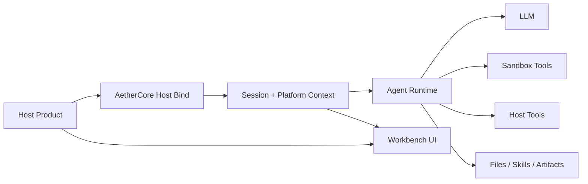

# AetherCore

[中文](./README.zh-CN.md)

> Agent infrastructure for teams that want to embed powerful AI agents into multiple products without rebuilding the runtime layer every time.

AetherCore is an Agent-as-a-Service platform that gives your products a shared agent runtime, embedded workbench, sandboxed execution, host integration layer, file and skill system, and long-context orchestration in one deployable stack.

Instead of rebuilding chat orchestration, tool execution, session storage, sandboxing, and embedded UX for every new product, you can plug them into AetherCore and reuse the same intelligence layer across projects.

## Why AetherCore

Most teams do not just need "a chatbot." They need a reusable agent platform that can:

- run safely in a sandbox,
- support long, tool-heavy sessions,
- plug into existing products,
- manage files, skills, and outputs,
- expose both standalone and embedded workbench experiences.

AetherCore is built for that layer.

## Highlights

- `Embed once, reuse everywhere`
  Connect multiple products to the same agent runtime through platform registration and host bind flows.

- `Standalone + embedded workbench`
  Use AetherCore directly as an internal workbench, or open it inside another product with an embed token.

- `Sandbox-first execution`
  Run commands in a Docker-first, fail-closed sandbox instead of relying on the host machine.

- `Files, skills, and artifacts`
  Upload working files, install reusable skills, and generate downloadable outputs inside a session.

- `Streaming runtime`
  Stream reasoning, content, and tool events through the same agent loop.

- `Long-context protection`
  Track token usage, compact history, and recover from context-overflow situations before sessions become unusable.

- `Platform baselines`
  Preload per-platform files, skills, and workspace material into new sessions.

## What It Looks Like



## Core Use Cases

- Add an agent workbench to an existing SaaS or internal platform.
- Centralize agent runtime infrastructure across multiple products.
- Run tool-using agents with sandboxed command execution.
- Support workflows that mix chat, files, reusable skills, and generated outputs.
- Give each host platform its own baseline workspace and configuration.

## Quick Start

### Prerequisites

- Python `3.11+`
- Node.js `20+`
- Docker

### 1. Configure the backend

Create `backend/.env` from [backend/.env.example](/C:/Work/AetherCore/backend/.env.example), then set at least:

- `LLM_BASE_URL`
- `LLM_MODEL`
- `LLM_API_KEY`
- `AUTH_SECRET_KEY`

For production-style configuration, start from [backend/.env.production.example](/C:/Work/AetherCore/backend/.env.production.example).

### 2. Install dependencies

```bash
cd backend
pip install -e .[dev]
```

```bash
cd frontend
npm install
```

### 3. Build the sandbox image

```bash
docker build -t aethercore-sandbox:latest -f docker/sandbox/Dockerfile .
```

### 4. Start the dev stack

```bash
python run_dev.py start
```

Useful commands:

```bash
python run_dev.py restart
python run_dev.py status
python run_dev.py build frontend
```

Default local ports:

- backend: `127.0.0.1:8100`
- frontend: `127.0.0.1:5178`

## Embed Into Your Product

The typical integration flow is:

1. Register a platform in AetherCore.
2. Keep the `host_secret` on your backend only.
3. Expose a host-side bind endpoint such as `/api/v1/aethercore/embed/bind`.
4. Return `token` and `session_id` to the browser.
5. Mount the embedded workbench with the universal adapter.

Host backend env should distinguish two addresses:

- `AETHERCORE_API_BASE_URL`: server-to-server AetherCore backend address used by your bind API to call `/api/v1/host/bind`
- `AETHERCORE_WORKBENCH_URL`: browser-facing AetherCore frontend address used to open the embedded workbench

Minimal example:

```html
<script src="/static/aethercore-embed.js"></script>
<script>
  window.mountAetherCore({
    platformKey: "your-platform-key",
    bindUrl: "/api/v1/aethercore/embed/bind",
    workbenchUrl: "https://ac.example.com",
    getUserId: function () {
      return window.currentUser?.id || "anonymous";
    }
  });
</script>
```

Related files:

- [host-adapters/universal/aethercore-embed.js](/C:/Work/AetherCore/host-adapters/universal/aethercore-embed.js)
- [host-adapters/universal/README.md](/C:/Work/AetherCore/host-adapters/universal/README.md)
- [docs/host-integration.md](/C:/Work/AetherCore/docs/host-integration.md)
- [docs/host-integration-standard.md](/C:/Work/AetherCore/docs/host-integration-standard.md)

## Repository Structure

```text
AetherCore/
  backend/          FastAPI runtime and APIs
  frontend/         React workbench
  host-adapters/    Embed shells and host integration assets
  docs/             Architecture and integration documents
  docker/           Sandbox image definitions
  ops/              Runtime and deployment notes
```

## Current Capabilities

Today, the repository already includes:

- admin login and standalone workbench access,
- embedded workbench access with platform bootstrap/bind flows,
- streaming agent chat via `/api/v1/agent/chat`,
- session history, rename, clone/bootstrap, and delete flows,
- file upload and artifact download,
- skill upload and skill injection,
- user-level and platform-level LLM overrides,
- platform baselines,
- sandbox command execution,
- host tool injection,
- token-aware context management and overflow recovery.

## Important APIs

- `/api/v1/auth`
- `/api/v1/platforms`
- `/api/v1/host`
- `/api/v1/agent`
- `/api/v1/agent/sessions`
- `/api/v1/agent/files`
- `/api/v1/agent/skills`
- `/api/v1/llm`
- `/api/v1/health`

## Running In Production

Production-oriented runtime helpers are included:

```bash
python run.py start
python run.py status
python run.py health
```

See also:

- [run.py](/C:/Work/AetherCore/run.py)
- [run_dev.py](/C:/Work/AetherCore/run_dev.py)
- [process_control.py](/C:/Work/AetherCore/process_control.py)
- [ops/production/README.md](/C:/Work/AetherCore/ops/production/README.md)

## Documentation

- [docs/architecture.md](/C:/Work/AetherCore/docs/architecture.md)
- [docs/context_management_mechanism.md](/C:/Work/AetherCore/docs/context_management_mechanism.md)
- [docs/host-integration.md](/C:/Work/AetherCore/docs/host-integration.md)
- [docs/host-integration-standard.md](/C:/Work/AetherCore/docs/host-integration-standard.md)
