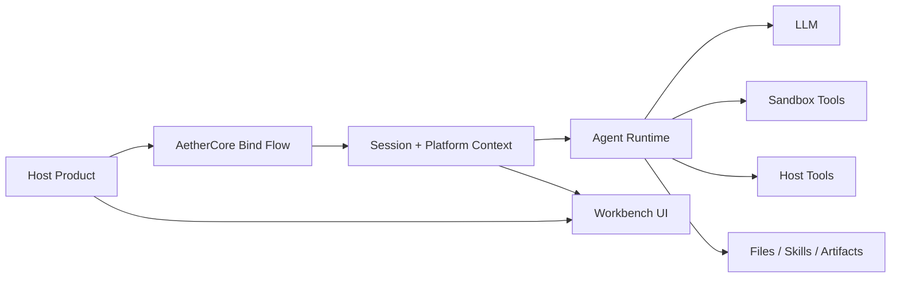

# AetherCore

[🌐 Live Demo](https://cryremis.github.io/aether-core) | [中文说明](./README.zh-CN.md)

> Agent infrastructure for multi-product integration scenarios, so teams do not have to rebuild an Agent Runtime from scratch for every product.

[](./LICENSE)
[](./backend/pyproject.toml)
[](./frontend/package.json)
[](./docker/sandbox/Dockerfile)

AetherCore is an Agent-as-a-Service platform that packages a shared Agent Runtime, an embedded Workbench, sandboxed execution, a host integration layer, files and skills, and long-context orchestration into one deployable foundation. Through an SDK-style integration path, teams can quickly embed a ready-made workbench into their own products.

The goal of the project is to let multiple products reuse the same Agent capability layer, instead of rebuilding chat orchestration, tool execution, session storage, sandbox security, and embedded interaction flows over and over again.

Whether you only want a chat surface or need a full AI Agent workbench, AetherCore can cover both.


## What AetherCore Provides

- Admin login and standalone workbench access
- Embedded workbench flows based on platform registration, bootstrap, and bind
- Dynamically injected tools, files, skills, and other host-side capabilities for the Agent to use
- User-level and platform-level LLM override configuration
- Platform baselines for files, skills, and workspace content
- Platform runtime image management and audit views

## Agent Capabilities

- Streaming long-context conversations
- Asking follow-up questions proactively and presenting options to users
- File upload and download
- Planning lists
- Skill upload and usage
- Sandboxed command execution
- Web search and retrieval
- Automatic long-context compaction
- Session branching, message editing, and rerunning conversations

## Product Preview

### Full Workbench


### Embedded Workbench Inside a Host Product


### Long-running Task Execution


### Platform Governance and Runtime Control


## Good Fit For

- Teams that want to embed an Agent panel into an existing SaaS product or internal system
- Teams that need the Agent to actually use tools, files, and command execution instead of only chatting
- Teams that want multiple products to share one Runtime
- Teams that need centralized model policy, platform baselines, and audit
- Teams that care about sandbox isolation and execution boundaries early

## Where It Sits In The System



## Typical Use Cases

- Embed an Agent workbench into an existing SaaS or internal system.
- Standardize Agent infrastructure for multiple products on one Runtime.
- Run tool-using Agents while isolating command execution in a sandbox.
- Support compound workflows that combine chat, files, skills, and generated artifacts.
- Inject different default workspace content and configuration for different platforms.

## Quick Start

### Prerequisites

- Python `3.11+`
- Node.js `20+`
- Docker

### 1. Configure the backend

Create `backend/.env` from `backend/.env.example`, and set at least:

- `LLM_BASE_URL`
- `LLM_MODEL`
- `LLM_API_KEY`
- `AUTH_SECRET_KEY`

If you want to prepare configuration in a more production-oriented way, start from `backend/.env.production.example`.

### 2. Install dependencies

```bash
cd backend
pip install -e .[dev]
```

```bash
cd frontend
npm install
```

### 3. Build the sandbox image

```bash
docker build -t aethercore-sandbox:latest -f docker/sandbox/Dockerfile .
```

### 4. Start the development environment

```bash
python run_dev.py start
```

Useful commands:

```bash
python run_dev.py status
python run_dev.py restart
python run_dev.py build frontend
```

### 5. Start the production environment

```bash
python run.py status
python run.py start
python run.py health
```

Default local ports:

- backend: `127.0.0.1:8100`
- frontend: `127.0.0.1:5178`

## How To Embed It Into Your Product

AetherCore can be embedded into an existing product as a workbench while still reusing the same backend Agent Runtime. A host product can bind the current user and page context into an AetherCore session, and can also expose host APIs as tools for the Agent to call when it needs product data or host-side actions.

Recommended integration flow:

1. Register a platform in AetherCore.
2. Keep `host_secret` only on your backend.
3. Provide a host-side bind endpoint, such as `/api/v1/aethercore/embed/bind`.
4. Return `token` and `session_id` to the browser.
5. Mount the embedded workbench through the universal adapter.
6. If the Agent needs to call your product APIs, add host tools as needed.

The admin console generates a dedicated integration guide for every registered platform. That is the main place to copy integration code, because it knows the current platform key, host secret, same-origin or cross-origin deployment mode, authentication mode, and backend framework template.

If you only need an embedded workbench, keep host capabilities empty. If you want the Agent to use product data, add host tools during bind so AetherCore can call controlled product APIs on behalf of the current user.

Relevant entry points:

- [host-adapters/universal/aethercore-embed.js](./host-adapters/universal/aethercore-embed.js)
- [host-adapters/universal/README.md](./host-adapters/universal/README.md)
- [docs/host-integration.md](./docs/host-integration.md)
- [docs/host-integration-standard.md](./docs/host-integration-standard.md)

## Repository Layout

```text
AetherCore/
  backend/          FastAPI runtime and APIs
  frontend/         React workbench
  host-adapters/    Host integration adapters and assets
  docs/             Architecture and integration docs
  docker/           Sandbox image definitions
  ops/              Runtime and deployment notes
  site/             Static GitHub Pages project site
```

## License

Apache-2.0. See [LICENSE](./LICENSE).
