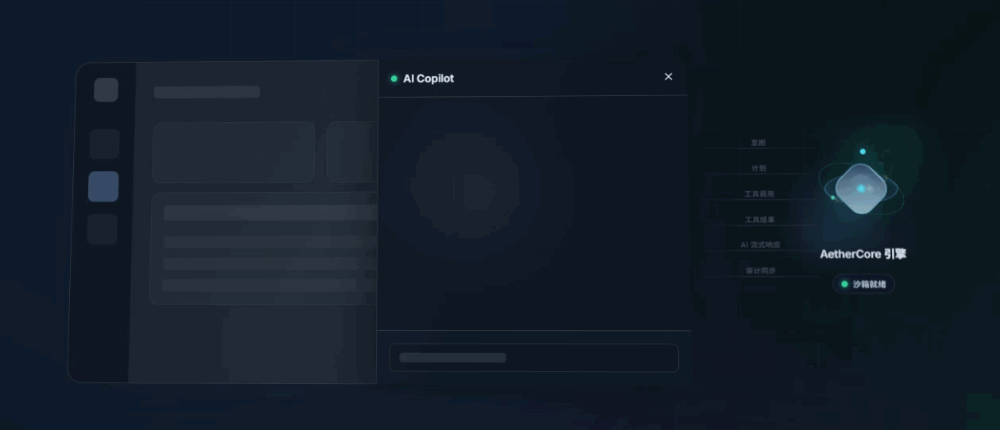
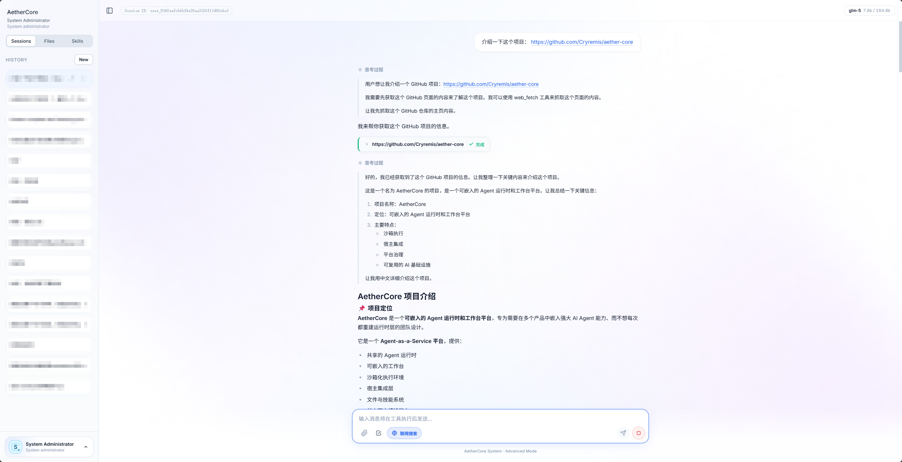
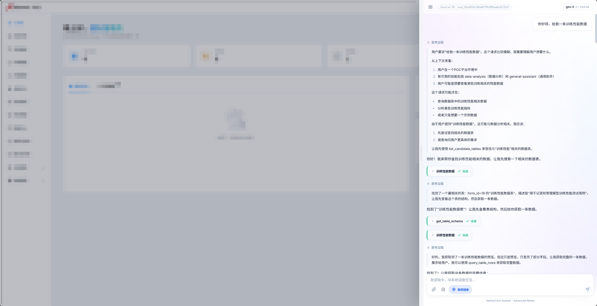
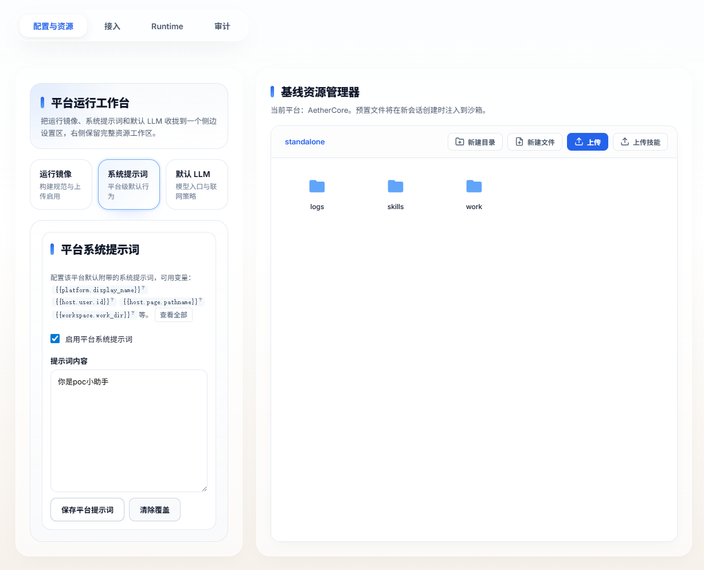
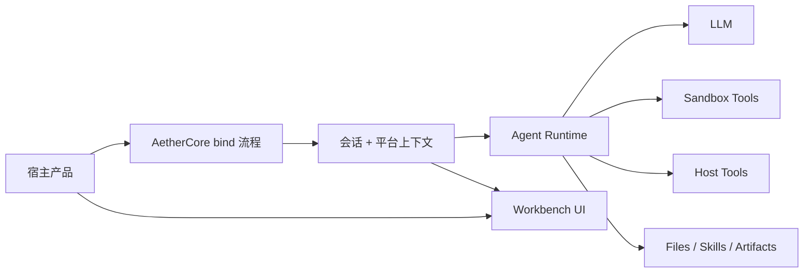

# AetherCore

[🌐 在线演示](https://cryremis.github.io/aether-core) | [English](./README.md)

> 面向多产品接入场景的 Agent 基础设施平台，不用每个项目都从头重建 Agent Runtime。

[](./LICENSE)
[](./backend/pyproject.toml)
[](./frontend/package.json)
[](./docker/sandbox/Dockerfile)

AetherCore 是一个 Agent-as-a-Service 平台，把共享 Agent Runtime、嵌入式 Workbench、沙箱执行、宿主接入层、文件与技能系统，以及长上下文编排能力整合成一套可部署的基础设施，通过 SDK 的方式让用户可以快速植入一个现成的工作台到自己的产品里。

项目目的是“让多个产品复用同一层 Agent 能力”，避免每个项目都重复搭建对话编排、工具执行、会话存储、沙箱安全和嵌入式交互层等。

无论你是只想要一个聊天页，还是需要一个完整的 AI Agent 工作台，它都可以满足你的需求。



## AetherCore 能提供什么

- 管理员登录与独立工作台访问
- 基于平台注册、bootstrap、bind 的嵌入式工作台流程
- 从宿主平台动态获取注入的工具、文件、技能等给 Agent 调用
- 用户级和平台级 LLM 覆盖配置
- 按平台注入文件、技能、工作区内容的基线能力
- 平台运行镜像管理与审计视图

## Agent 能力清单

- 流式的连续长上下文对话
- 主动向用户提问并提供选项
- 文件上传、下载
- 计划列表
- 技能上传与使用
- 沙箱命令执行
- 联网搜索与获取
- 长上下文自动压缩
- 会话分支、编辑消息、重跑对话

## 产品预览

### 完整工作台



### 嵌入到宿主产品里的工作台



### 长任务执行 


### 平台治理与运行时控制



## 适合什么场景

- 想把 Agent 面板嵌进现有 SaaS 或内部系统
- 需要 Agent 真正使用工具、文件和命令执行，而不只是聊天
- 希望多个产品共用一套 Runtime
- 需要统一管理模型策略、平台基线和审计
- 较早就重视沙箱隔离和运行边界

## 它在系统里的位置



## 典型使用场景

- 给现有 SaaS 或内部系统嵌入 Agent 工作台。
- 把多个产品的 Agent 基础设施统一到一套 Runtime 上。
- 运行带工具调用的 Agent，并把命令执行隔离在沙箱中。
- 支持“聊天 + 文件 + 技能 + 产物输出”的复合型工作流。
- 按平台注入不同的默认工作区内容和配置。

## 快速开始

### 环境要求

- Python `3.11+`
- Node.js `20+`
- Docker

### 1. 配置后端

基于 `backend/.env.example` 创建 `backend/.env`，至少填写：

- `LLM_BASE_URL`
- `LLM_MODEL`
- `LLM_API_KEY`
- `AUTH_SECRET_KEY`

如果要按生产环境方式准备配置，建议从 `backend/.env.production.example` 开始。

### 2. 安装依赖

```bash
cd backend
pip install -e .[dev]
```

```bash
cd frontend
npm install
```

### 3. 构建沙箱镜像

```bash
docker build -t aethercore-sandbox:latest -f docker/sandbox/Dockerfile .
```

### 4. 启动开发环境

```bash
python run_dev.py start
```

常用命令：

```bash
python run_dev.py status
python run_dev.py restart
python run_dev.py build frontend
```

### 5. 启动生产环境

```bash
python run.py status
python run.py start
python run.py health
```

默认本地端口：

- backend: `127.0.0.1:8100`
- frontend: `127.0.0.1:5178`

## 如何嵌入到你的产品

AetherCore 可以作为工作台嵌入到已有产品里，同时继续复用同一套后端 Agent Runtime。宿主产品可以把当前用户、页面上下文绑定到 AetherCore 会话中，也可以按需把宿主 API 暴露成 Agent 可调用的工具，让 Agent 在对话中查询产品数据或触发宿主侧动作。

推荐接入流程是：

1. 在 AetherCore 中注册平台。
2. 仅在你的后端保存 `host_secret`。
3. 提供一个宿主侧 bind 接口，例如 `/api/v1/aethercore/embed/bind`。
4. 将 `token` 和 `session_id` 返回给浏览器。
5. 通过通用 adapter 挂载内嵌工作台。
6. 如需让 Agent 调用网站 API，再按需添加宿主工具。

管理台会为每个已注册平台生成专属“接入教程”。那里是复制接入代码的主入口：它知道当前平台的 platform key、host secret、同域或跨域部署方式、认证模式和后端框架模板。

如果只需要嵌入工作台，保持宿主能力为空即可；如果希望 Agent 使用产品数据，再在 bind 时添加宿主工具，让 AetherCore 代表当前用户调用受控的网站 API。

相关入口：

- [host-adapters/universal/aethercore-embed.js](./host-adapters/universal/aethercore-embed.js)
- [host-adapters/universal/README.md](./host-adapters/universal/README.md)
- [docs/host-integration.md](./docs/host-integration.md)
- [docs/host-integration-standard.md](./docs/host-integration-standard.md)

## 仓库结构

```text
AetherCore/
  backend/          FastAPI runtime 与 API
  frontend/         React workbench
  host-adapters/    宿主接入 adapter 与资产
  docs/             架构与接入文档
  docker/           沙箱镜像定义
  ops/              运行与部署说明
  site/             GitHub Pages 静态项目页
```

## License

Apache-2.0，见 [LICENSE](./LICENSE)。
