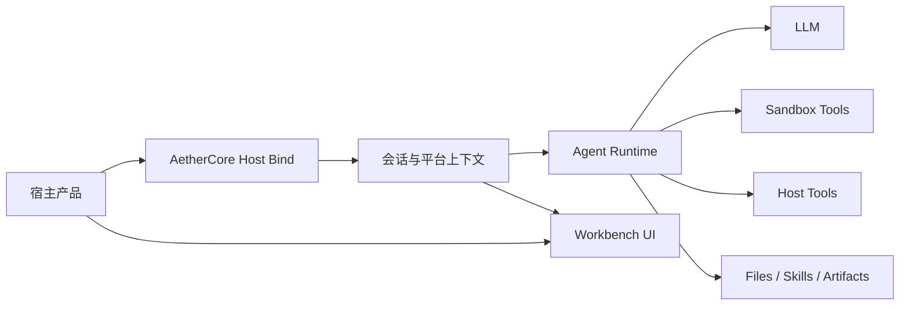

# AetherCore

[English](./README.md)

> 面向多产品接入场景的 Agent 基础设施平台，不用每个项目都从头重建 Agent Runtime。

AetherCore 是一个 Agent-as-a-Service 平台，把共享 Agent Runtime、嵌入式 Workbench、沙箱执行、宿主接入层、文件与技能系统，以及长上下文编排能力整合成一套可部署的基础设施。

它要解决的不是“做一个聊天框”，而是“让多个产品复用同一层 Agent 能力”，避免每个项目都重复搭建对话编排、工具执行、会话存储、沙箱安全和嵌入式交互层。

## 为什么是 AetherCore

很多团队真正需要的并不是一个单独的 AI 对话页，而是一层可复用的 Agent 平台，这层平台需要同时具备：

- 安全的沙箱执行，
- 支持长会话和重工具链路，
- 能嵌入现有业务产品，
- 能管理文件、技能和输出产物，
- 同时支持独立工作台和嵌入式工作台。

AetherCore 就是为这层基础设施设计的。

## 核心亮点

- `一次接入，多处复用`
  多个产品都可以通过平台注册和 host bind 流程接入同一套 Agent Runtime。

- `独立工作台 + 嵌入工作台`
  既可以把 AetherCore 当成独立内部工作台使用，也可以以内嵌方式挂到其它系统中。

- `沙箱优先`
  默认通过 Docker fail-closed 模型执行命令，而不是直接依赖宿主机。

- `文件、技能、产物一体化`
  一个会话里可以上传文件、安装技能，并生成可下载输出。

- `流式 Runtime`
  reasoning、正文和工具事件都走同一套流式 Agent 执行链路。

- `长上下文保护`
  持续跟踪 token 使用量，支持压缩和上下文溢出恢复。

- `平台基线`
  不同宿主平台可以为新会话注入默认文件、技能和工作区内容。

## 它的整体位置



## 典型使用场景

- 给现有 SaaS 或内部系统嵌入 Agent 工作台。
- 把多个产品的 Agent 基础设施统一到一套 Runtime 上。
- 运行带工具调用的 Agent，并把命令执行隔离在沙箱中。
- 支持“聊天 + 文件 + 技能 + 产物输出”的复合型工作流。
- 按平台注入不同的默认工作区内容和配置。

## 快速开始

### 环境要求

- Python `3.11+`
- Node.js `20+`
- Docker

### 1. 配置后端

基于 [backend/.env.example](/C:/Work/AetherCore/backend/.env.example) 创建 `backend/.env`，至少配置：

- `LLM_BASE_URL`
- `LLM_MODEL`
- `LLM_API_KEY`
- `AUTH_SECRET_KEY`

如果要按生产环境方式准备配置，建议从 [backend/.env.production.example](/C:/Work/AetherCore/backend/.env.production.example) 开始。

### 2. 安装依赖

```bash
cd backend
pip install -e .[dev]
```

```bash
cd frontend
npm install
```

### 3. 构建沙箱镜像

```bash
docker build -t aethercore-sandbox:latest -f docker/sandbox/Dockerfile .
```

### 4. 启动开发环境

```bash
python run_dev.py start
```

常用命令：

```bash
python run_dev.py restart
python run_dev.py status
python run_dev.py build frontend
```

默认本地端口：

- backend: `127.0.0.1:8100`
- frontend: `127.0.0.1:5178`

## 嵌入到你的产品

推荐接入流程是：

1. 在 AetherCore 中注册平台。
2. 仅在你的后端保存 `host_secret`。
3. 提供一个宿主侧 bind 接口，例如 `/api/v1/aethercore/embed/bind`。
4. 将 `token` 和 `session_id` 返回给浏览器。
5. 通过通用 adapter 挂载内嵌工作台。

宿主后端环境变量里要区分两个地址：

- `AETHERCORE_API_BASE_URL`：后端调 AetherCore 后端 `/api/v1/host/bind` 时使用的服务端地址
- `AETHERCORE_WORKBENCH_URL`：返回给浏览器打开内嵌工作台时使用的前端地址

最小示例：

```html
<script src="/static/aethercore-embed.js"></script>
<script>
  window.mountAetherCore({
    platformKey: "your-platform-key",
    bindUrl: "/api/v1/aethercore/embed/bind",
    workbenchUrl: "https://ac.example.com",
    getUserId: function () {
      return window.currentUser?.id || "anonymous";
    }
  });
</script>
```

相关文件：

- [host-adapters/universal/aethercore-embed.js](/C:/Work/AetherCore/host-adapters/universal/aethercore-embed.js)
- [host-adapters/universal/README.md](/C:/Work/AetherCore/host-adapters/universal/README.md)
- [docs/host-integration.md](/C:/Work/AetherCore/docs/host-integration.md)
- [docs/host-integration-standard.md](/C:/Work/AetherCore/docs/host-integration-standard.md)

## 仓库结构

```text
AetherCore/
  backend/          FastAPI runtime 与 API
  frontend/         React workbench
  host-adapters/    嵌入壳与宿主接入资产
  docs/             架构与接入文档
  docker/           沙箱镜像定义
  ops/              运行与部署说明
```

## 当前已经具备的能力

当前仓库已经包含：

- 管理员登录与独立工作台访问，
- 基于平台注册和 bind/bootstrap 的嵌入工作台访问，
- 通过 `/api/v1/agent/chat` 提供的流式 Agent 对话，
- 会话历史、重命名、新会话引导和删除，
- 文件上传与产物下载，
- 技能上传与技能注入，
- 用户级和平台级 LLM 覆盖配置，
- 平台基线能力，
- 沙箱命令执行，
- 宿主工具注入，
- 基于 token 感知的上下文管理与溢出恢复。

## 主要 API

- `/api/v1/auth`
- `/api/v1/platforms`
- `/api/v1/host`
- `/api/v1/agent`
- `/api/v1/agent/sessions`
- `/api/v1/agent/files`
- `/api/v1/agent/skills`
- `/api/v1/llm`
- `/api/v1/health`

## 生产运行

仓库内已经提供偏生产运行风格的脚本：

```bash
python run.py start
python run.py status
python run.py health
```

另可参考：

- [run.py](/C:/Work/AetherCore/run.py)
- [run_dev.py](/C:/Work/AetherCore/run_dev.py)
- [process_control.py](/C:/Work/AetherCore/process_control.py)
- [ops/production/README.md](/C:/Work/AetherCore/ops/production/README.md)

## 相关文档

- [docs/architecture.md](/C:/Work/AetherCore/docs/architecture.md)
- [docs/context_management_mechanism.md](/C:/Work/AetherCore/docs/context_management_mechanism.md)
- [docs/host-integration.md](/C:/Work/AetherCore/docs/host-integration.md)
- [docs/host-integration-standard.md](/C:/Work/AetherCore/docs/host-integration-standard.md)
